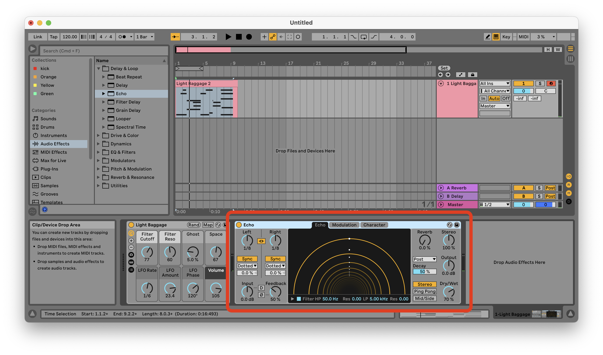
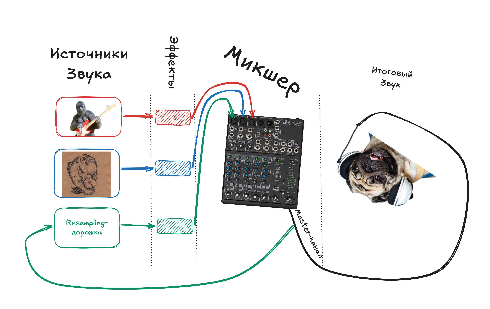
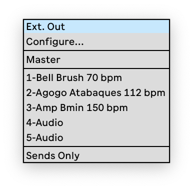
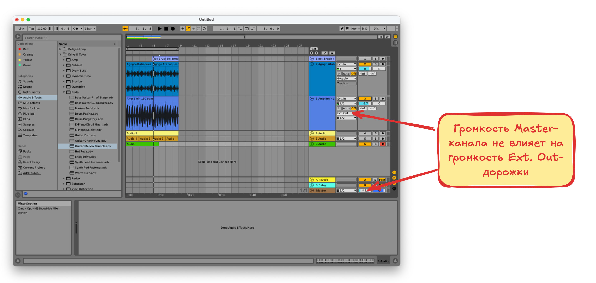
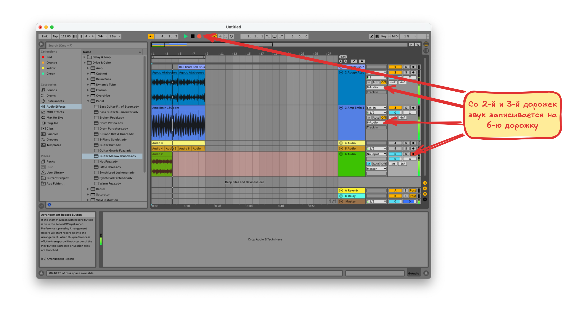
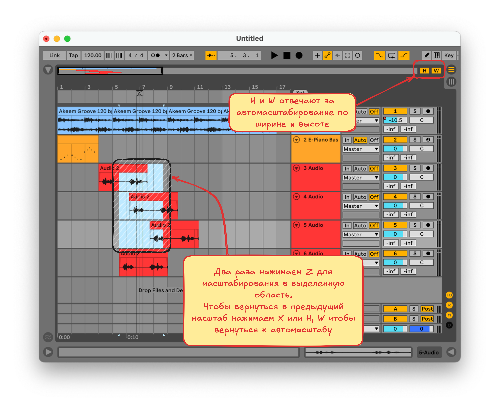

# Изучаем Ableton

По курсу от [отечественного битмейкера](https://www.youtube.com/watch?v=cdcgVkYV0k4&t=3191s)

## [Горячие Кнопки](./hotkeys.md)

По ссылке список известных мне так называемых горячих клавиш

## Советы

Полезно изучить системные выпадающие меню

Особенно меню **View**

Нажимаем на пункт меню и смотрим что меняется в интерфейсе

## [DAW (Digital Audio Workstation)](https://www.youtube.com/watch?v=cdcgVkYV0k4&t=3191s)

Все **DAW** программы работают по одному принципу

**Источники** звука отправляют сигналы в **плагины**, которые как-то обрабатывают звук и отправляют в **микшер**, где , который объединяет все обработанные звуки в **итоговый**, при этом на микшере так-же можно сделать некоторую обработку, например увеличить/уменьшить громкость определённых частот (см. крутилки на микшере)

## [Интерфейс, плэйлист, браузер](https://youtu.be/cdcgVkYV0k4?si=cMZCAJBRxUy0doN7&t=664)

Посмотрим что мы видим перед собой при первом запуске **Ableton**, разберём зачем тут столько всего

## [MIDI (Musical Instrument Digital Interface) дорожки](https://youtu.be/cdcgVkYV0k4?si=ovXWhRoDmKv3r-Yf&t=1912)

**MIDI** это цифровой инструмент. Для того чтобы записать на дорожку звук, генерируемый таким инструментов необходимо

1. Создать **MIDI**-дорожку, если её ещё нет и назначить инструмент
2. После назначения инструмента можно поиграть на нём с помощью клавиатуры компьютера на клавишах `A-W-S-E-D-F-T-G-Y-H-U-J-K`. Эти клавиши имитируют одну октаву клавиш пианино. Для того, чтобы слышать звук выбранного инструмента, необходимо включить режим игры на клавиатуре либо **In** либо **Auto** со включённым режимом записи на дорожку. При включённом режиме игры на клавиатуре некоторые сочетания клавиш могут не работать, поэтому его нужно не забывать выключать
3. После этого необходимо **выделить участок на дорожке**, в этот участок будет записана последовательность звуков, которые будут воспроизводиться инструментом. По выделенному участку нажимаем правой кнопкой и выбираем **Insert Empty MIDI Clip(s)** 
4. Теперь на дорожке появилась область в которую можно записать звуки с помощью **Piano Roll**, это область внизу экрана. Чтобы добавить ноту на **Piano Roll** нажимаем 2 раза мышкой в нужном месте, и в этом месте появится нота. Так-же можно записывать звук в реальном времени, нажав кнопку **запись** в верхней части окна. Если звука нет, нужно убедиться что нажата **кнопка со значком ноты** в правой части дорожки, эта кнопка обозначает что запись производится на выбранную дорожку 

### [Из audio в MIDI](https://youtu.be/cdcgVkYV0k4?si=PKfoA7ujtLyquWEN&t=2352)

На пустую **MIDI**-дорожку можно перетащить любой звуковой файл, и попробовать конвертировать его в последовательность звуков, которые могут быть проиграны инструментом

## [Эффекты](https://youtu.be/cdcgVkYV0k4?si=B-Hy4Ipm9H8UPT8O&t=2989)

Перетаскиваем эффект в секцию эффектов дорожки. Ну и теперь у нас дорожка с эффектом

## [Микшер](https://youtu.be/cdcgVkYV0k4?si=AAApZ2UJl63TXLJ0&t=3182)

Принимает звук из разных дорожек и смешивает в одну дорожку. Для каждой дорожки имеет слеюдующие настройки

- **Mute**, **Solo**. Глушение дорожки / Глушение всех дорожек кроме выбранной

- **Volume**, **Panorama**. Уменьшение громкости и направление звука в правый/левый канал
- **Send**-фейдеры. Регулируют уровень сигнала, поступающего в **Send**-канал
- **Return**-дорожки. Дорожки в которые приходит сигнал из **Send**-каналов

- **Master**. Параметры итогового исходящего сигнала. А так-же почему тут регулируется **громкость прослушиваемых инструментов**

## [Send и Return дорожки](https://youtu.be/cdcgVkYV0k4?si=juT5TGC2g6J5qin2&t=4158)

Предоставляют возможность скопировать сигнал с выбранной дорожки/дорожек на какую внешнюю панель эффектов, после применения эффектов, сигнал поступит обратно в микшер на **Return** канал

### Схема движения звука

### Как это выглядит физически

Распологаются над **Master**-дорожкой. За подачу сигнала на эти дорожки отвечают фэйдеры на дорожке в нижней части блока микшера. Удобнее управлять этими дорожками в режиме сессии

На эти дорожки **копируется** звук, приходящий в микшер, этот звук там тоже как-то обрабатывается и то, что получилось отправляется в **Master**-канал, и там это всё сливается в один звук

**Return**-дорожки могут быть в режиме **Pre-Fader** (звук отправляется в **Return** канал до применения настроек микшера, влияет только настройка громкости звука) и **Post-Fader** (звук отправляется в **Return** канал после применения настроек микшера). Чтобы понять как это влияет на звук проще потыкать это в программе

**Send/Return**-дорожки используются в основном при сведении звука

## [Группировка дорожек](https://youtu.be/cdcgVkYV0k4?si=0ThIkpUs4uCYW5wf&t=5359)

Дорожки можно объединять в группы. При группировке дорожек их исходящий сигнал идёт в микшер группового канала, после чего в итоговый микшер. К группе можно применять эффекты и настривать параметры микширования так же как у отдельной дорожке

- Создать группу
  1. Выделить несколько дорожек с зажатым `Shift` или `Cmd`
  2. Нажать правой кнопкой и выбрать **Group Tracks**
- Разгруппировать можно нажав правой кнопкой на группе и выбрав **Ungroup Tracks**
- Добавить дорожку в группу можно путём перетаскивания
- Убрать дорожку из группы так-же путём перетаскивания за пределы группы

## [Запись](https://youtu.be/cdcgVkYV0k4?si=XmU7o8RxYQChUEjI&t=6602)

За запись отвечает блок контроля входящего сигнала `(1)`. Показать/скрыть его можно из меню `View -> In/Out`

### Выбор записывающего устройства

Выпадающее меню `(2)` позволяет выбрать с какого канала устройства производить запись

### Вывод звука с записывающего устройства

Блок **Мониторинга** `(3)` отвечает за то будет ли пропускаться сигнал с выбранного канала дальше на микшер

- **In** - пропускать сигнал всегда
- **Auto** - пропускать сигнал только в режиме записи `(4)`
- **Off** - не пропускать сигнал

### Запись на дорожку

Для начала записи звука на дорожку нужно 

- Нажать кнопку записи на дорожке `(4)`. Нажатая кнопка показывает на какую дорожку будет производиться запись
- Нажать кнопку записи в блоке `(5)`

После чего звук начнёт записываться. Для завершения записи можно нажать кнопку **Record** или **Stop** в блоке `(5)`

На дорожку с записанным звуком можно применять эффекты

## [Коммутация каналов](https://youtu.be/cdcgVkYV0k4?si=rRl9AsLsv5wZPd8F&t=7674)

У дорожек есть параметры коммутации

- **Откуда брать** сигнал. По умолчание **Ext. In** (внешний источик (обычно это звуковая карта))
- **Куда выводить** сигнал. По умолчанию **Master**-дорожка микшера

### Варианты входящего сигнала

#### Ext. In

Это обычно внешняя звуковая карта

#### Configure

Позволяет быстро открыть меню выбора входящего звукового устройства

#### Resampling

Этот режим позволяет записать звук из **Master**-канала микшера, сигнал при этом не будет зацикливаться, так как при записи **Abelton** не пропустит этот сигнал на микшер по второму кругу. В программе это видно по тому, что полоски уровня звука на **Resampling**-дорожке будут серого цвета

##### Запись на Resampling-дорожку

1. Создать пустой **Audio Track**
2. Выбрать на нём **Resampling** в качестве входящего сигнала
3. Включить запись на дорожке
4. Записать звук
5. Теперь у нас есть дорожка, на которой записан итоговый звук из **Master**-канала микшера. Наверное это зачем-то нужно :)

#### Дорожка

При записи с другой дорожки звук копируется в одном из трёх возможных мест, до **эффектов**, после **эффектов и до микшера** и **после микшера** 

Все варианты под **Resampling** (кроме **Master**) это другие дорожки проекта, любую из них можно выбрать как источник и записать звук, выбрав в каком месте звук должен быть скопирован

 

#### Master

То-же самое что и **Resampling**, но без контроля зацикливания сигнала. Лучше не использовать

#### No Input

Ставим когда ничего не хотим записывать на дорожку

### Варианты исходящего сигнала

#### Ext. Out

Сигнал направляется напрямую на наушники/колонки, миную мастер канал. Настройки громкости мастер канала не будут влиять на выбранную дорожку

#### Configure

Быстрый доступ к настройкам аудиоустройства

#### Master

Выводить сигнал на **Master**-канал, учитывая его настройки громкости, установлено по умолчанию

#### Дорожка

Выводить сигнал с одной или нескольких дорожек можно на другую дорожку, это возволит записать звук с нескольких дорожек на другую дорожку. Это не то-же самое, что запись с мастер канала, так как можно записывать не со всех дорожек а только с выбранных

Для записи звука с других дорожек необходимо установить на них необходимую дорожку в качестве выхода и произвести запись

## [Инструменты](https://youtu.be/cdcgVkYV0k4?si=OoQ4xQGHTVNOZhRU&t=9370)

Рассмотрим блок кнопок в верхней части программы

### Темп

Инструменты управления темпом позволяют

- **Tap**. Настучать темп по тачпаду
- **Tempo**. Установить темп руками
- **Methronome**. Включить/Выключить метроном

### Следующий Блок. Тут всё подряд

Тут всё перемешано, кнопки в этом блоке позволяют

- **Follow**. Следить за курсором во время воспроизведения
- **Arrangement**. Перейти к определённому такту и месту внутри такта
- **Play**, **Stop**, **Record**. Проиграть/Остановить/Записать **MIDI** или звук
- **MIDI Arrangements Overdub**. Перейти в режим добавления нот в существующих **MIDI**-клип. Это делается в режиме записи на **MIDI**-клипе
- **Automation Arm**. Записать автоматизацию параметров. Производится в **режиме записи**. Автоматизированный параметр будет отмечен красной точкой. Посмотреть автоматизированные параметры можно из меню `View -> Automation Mode` или нажав `A`
  - **Draw Mode Switch**. Автоматизацию можно так-же **рисовать на дорожке**, нажав значок **карандаша**, по умолчанию рисование **выравнивается** по сетке, чтобы рисовать без выравнивания нужно удерживать `Cmd`
  - Чтобы **удалить автоматизацию** нужно нажать правой кнопкой по автоматизированному параметру (это параметр с красной точкой) и выбрать `Delete Automation`
  - **Re-Enable Automation**. Если автоматизация была перезписана (например случайно покрутили автоматизированный фейдер) то её можно восстановить нажав на эту кнопку
- **Capture MIDI**. Вставить на **MIDI**-дорожку недавно проигранную мелодию. То-есть можно наиграть мелодию, не записывая её на дорожку, нажать **Capture MIDI**, и мелодия появится на дорожке, как если бы мы её записали
- **Punch-In/Out Switch**. Ограничить область записи (**Loop Switch** при этом должен быть выключен). Запись будет производиться только в ограниченную выделением область. Ограничить можно начало и/или конец участка

### Ещё один блок со всем подряд

- **Computer MIDI keyboard**. Использовать клавиши компьютера как **MIDI**-клавиши
- **Key Map Mode Switch**. Назначить клавишу на действие в программе
  1. Выбираем элемент интрефейса на который хотим назначить клавишу
  2. Нажимаем эту клавишу
  3. Чтобы удалить удалить клавишу от элемента интерфейса снова нажимаем **Key Map Mode Switch**, нажимаем правой кнопкой на элемент интерфеса и выбираем `Delete Mapping`

## [Навигация](https://youtu.be/cdcgVkYV0k4?si=4ByqVOGCOYf-YzRe&t=10745)

Разберём какие есть способы масштабировать плейлист и перемещаться по нему

- На **macOS** поддерживаются жесты тачпада, на **Windows** можно нажать `Ctrl+Alt` для активации инструмента **Hand**. На маке тоже можно нажать `Cmd+Opt` но там удобнее пользоваться тачпадом
- Изменение масштаба по **горизонтали** производится прокруткой с зажатым `Cmd`. Изменение масштаба по **вертикали** производится прокуткой с зажатым `Opt`, но действует только на одну дорожку, чтобы масштабировать несколько дорожек нужно их выбрать в правой части окна программы, выделить все дорожки можно нажав `Cmd+A`
- Масштабирование в выделенную область производится нажатием `Z` два раза, первое нажатие масштабирует по горизонтали, второе по вертикали. Чтобы вернуться к предыдущему масштабу можно нажать `X`  или  `H`, `W` чтобы вернуться к автомасштабу
- `H` и `W` отвечают за автомасштабирование по горизонтали и вертикали

## [Рендер и Экспорт](https://youtu.be/cdcgVkYV0k4?si=CPfRVsof4Y6pHEH1&t=11290)

Готовый звуковой файл экспортируется через `File -> Export Audio/Video`. Разберём настройки экспорта

### Selection

Тут выбираем участок дорожки и участок проекта, которые хотим экспортировать 

- **Rendered Tracks**. Какие дорожки экспортировать 
  - **Master**. Мастер дорожку из микшера
  - **All Individual Tracks**. Все дорожки проекта
  - **Selected Tracks Only**. Только выбранные дорожки
  - Дальше можно выбрать конкретную дорожку проекта
- **Render Start**. Начальный такт для экспорта
- **Render Length**. Сколько тактов от начального экспортировать

### Rendering Options

- **Include Return and Master Effects**. Доступно при экспорте отедльной дорожки/дорожек. Применять ли эффекты из **Send**-дорожек или сохранять их отдельно
- **Render as Loop**. Экспортированный звук возможно будет зациклить
- **Convert to Mono**. Преобразовать звук в одноканальный
- **Normalize**. Если громкость в проекте нигде не достигает максимального значения, то самый громкий звук будет приравнен к максимальному уровню громкости, а громкость остальных звуки смасштабирована
- **Create Analysis File**. Создать файл с метаданными. Ускоряет загрузку звукового файла и сохраняет данные о некоторых применённых эффектах
- **Sample Rate**. Частота дискретизации. Нужно ставить такую-же как в настройках входного устройства. Обычно **48000**

### PCM (Pulse-Code Modulation). Звук без потери качества

- **Encode PCM**. Вкл/Выкл
- **File Type**. Тип файла
- **Bit Depth**. Битность файла. Максимум **32** бита, в этом случае **Dithering**-а не будет
- **Dither Options**. **Dither в PCM-звуке** это техника добавления **слабого случайного шума** (обычно в районе -90…-120 dB) при понижении разрядности аудио (например, при конвертации 24-бит → 16-бит)
  - **Rectangular**. простой белый шум
  - **Triangular**. более мягкое распределение шума (чаще используется)
  - **Noise Shaping**. сложный алгоритм, смещающий шум в менее слышимые частоты

### MP3

- **Encode MP3**. Экспорт в **MP3** файл

### Video

Тут всякие настройки экспорта видео

## TODO

Переделать скиншоты через **Excalidraw**

## Материалы

- [Картинки](https://excalidraw.com/#json=TmBUA64T4uukpk_kYsL4O,g1bMITlU4yb7yc_LYcRuYA)

