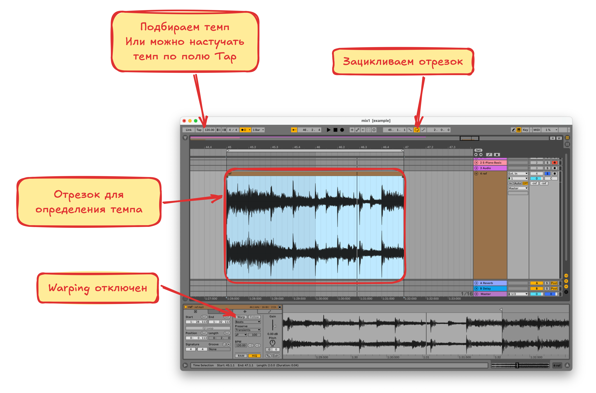

# Анализ Референса

**Референс** в сэмплировании это **оригинальный звук или трек**, который используется как образец для создания или обработки сэмпла. Это может быть:

- **Фрагмент музыки** (например, барабанный брейк, вокальная фраза, мелодия)
- **Звук из фильма, природы или бытовой шум** (скрип двери, шум толпы)
- **Готовая композиция**, которую разбирают на части для заимствования элементов

**Анализ референса** нужен для определения ориентиров при создании собственного произведения

## Тональность

**Тональность в музыке** это система организации звуков вокруг **главного тона (тоники)**, которая определяет лад (мажор/минор) и набор используемых нот (гамму)

### Подбор тональности

1. Переносим референс на аранжировку и выбираем отрезок, на котором будем определять тональность (выделяем часть референса, разделяем его и зацикливаем выбраный участок)
2. Создаём рядом **MIDI**-дорожку со стандартным пианином (**E-Piano Basic**) и добавляем эффект **Pitch**
3. Воспроизводим референс и одновременно играем гамму или просто ноты в определённом ладу и  тональности, как только тональность подошла значит это она и есть. Для удобства можно перемещаться между тональностями с помощью эффекта **Pitch**. Так-же гамму можно не играть а добавить на **Piano Roll**, как удобнее

## Темп

**Темп** это скорость исполнения музыки, измеряемая в **ударах в минуту (BPM)**

### Подбор темпа

1. Выделяем из трека отрезок длинной 1 или 2 такта
2. Отключаем варпинг на дорожке если он включён. Для этого нажимаем на шапку трека в окне аранжировки
3. Крутим **BPM** в **Ableton** пока выделеный отрезок не начнёт влезать **равно** в такт. Так-же можно включить метроном или настучать темп по полю **Tap**

