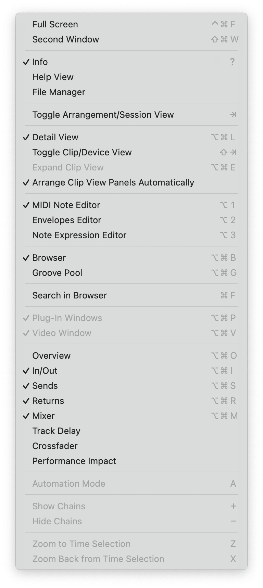
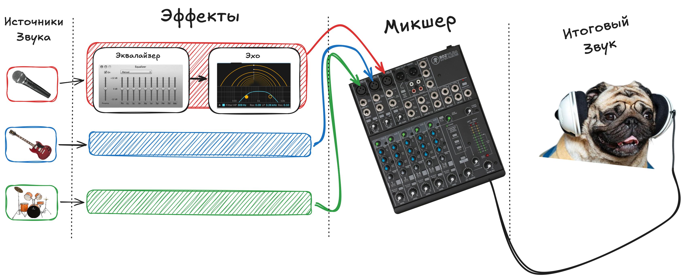
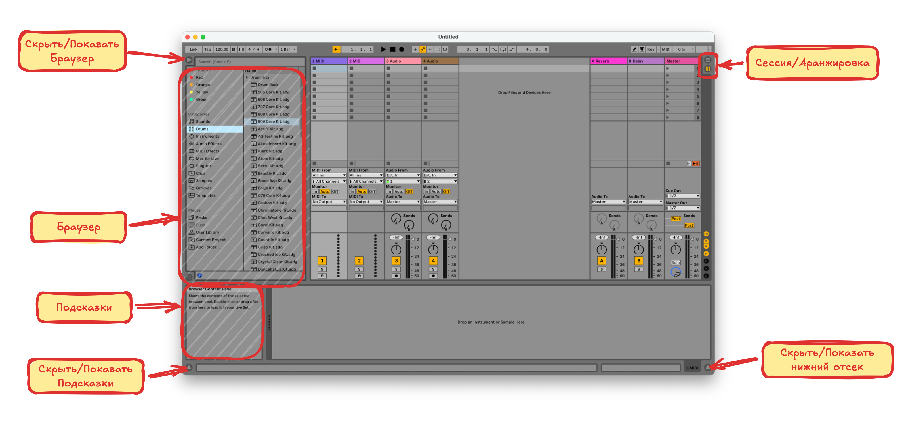
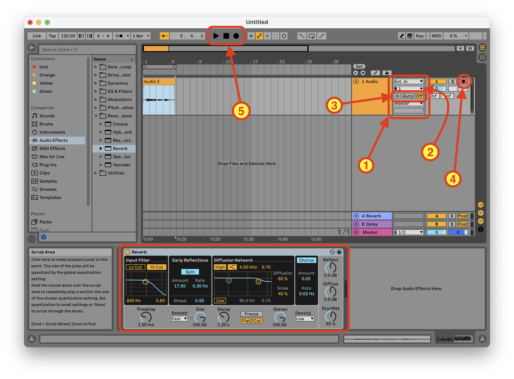

# Конспектик по Abelton 11 Live

По курсу от [отечественного битмейкера](https://www.youtube.com/watch?v=cdcgVkYV0k4&t=3191s)

## Советы

Полезно изучить системные выпадающие меню

Особенно меню `View`

Нажимаем на пункт меню и смотрим что меняется в интерфейсе

## [DAW (Digital Audio Workstation)](https://www.youtube.com/watch?v=cdcgVkYV0k4&t=3191s)

Все **DAW** программы работают по одному принципу

**Источники** звука отправляют сигналы в **плагины**, которые как-то обрабатывают звук и отправляют в **микшер**, где , который объединяет все обработанные звуки в **итоговый**, при этом на микшере так-же можно сделать некоторую обработку, например увеличить/уменьшить громкость определённых частот (см. крутилки на микшере)

[Excalidraw](https://excalidraw.com/#json=fsvEAm0fHzIu6njjnLPPe,ndMv8SW_-iXxpKqx2Vg9UQ)

## [Интерфейс, плэйлист, браузер](https://youtu.be/cdcgVkYV0k4?si=cMZCAJBRxUy0doN7&t=664)

Посмотрим что мы видим перед собой при первом запуске Abelton, разберём зачем тут столько всего

## [MIDI дорожки](https://youtu.be/cdcgVkYV0k4?si=ovXWhRoDmKv3r-Yf&t=1912)

- Создаём `MIDI` дорожки
- Назначаем на них инструменты
- Редактируем `piano roll`

### [Из audio в MIDI](https://youtu.be/cdcgVkYV0k4?si=PKfoA7ujtLyquWEN&t=2352)

1. Назначаем инструмент на `MIDI` дорожку
2. Перетаскиваем на дорожку звуковой файл
3. Извлекаем из него мелодию или гармонию на `piano roll`

## [Эффекты](https://youtu.be/cdcgVkYV0k4?si=B-Hy4Ipm9H8UPT8O&t=2989)

Перетаскиваем эффект в секцию эффектов дорожки

## [Микшер](https://youtu.be/cdcgVkYV0k4?si=AAApZ2UJl63TXLJ0&t=3182)

Принимает звук из разных дорожек и смешивает в одну дорожку

- `Mute/Solo` для дорожек
  - `Cmd+Solo`
- Панарамирование
- Настройки `Master`-дорожки

## [Return-дорожки](https://youtu.be/cdcgVkYV0k4?si=juT5TGC2g6J5qin2&t=4158)

Почему-то в видео называются `Send`-дорожками

Это такие дорожки, на которые послается звук, приходящий в микшер, этот звук там тоже как-то обрабатывается и то, что получилось отправляется `master` канал, и там это всё сливается в один звук. Могут быть в режиме `pre-fader` (звук отправляется в `return`-канал до применения настроек микшера) и `post-fader` (звук отправляется в `return`-канал после применения настроек микшера)

Нужно при сведении звука

## [Группировка дорожек](https://youtu.be/cdcgVkYV0k4?si=0ThIkpUs4uCYW5wf&t=5359)

Дорожки можно объединять в группы. При группировке дорожек их выходной сигнал идёт в микшер группового канала, после чего в итоговый микшер. К группе можно применять эффекты и настривать параметры микширования так же как у отдельной дорожке

- Создать группу
  1. Выделить несколько дорожек с зажатым `Shift` или `Cmd`
  2. Нажать правой кнопкой и выбрать `Group Tracks`
- Разгруппировать можно нажав правой кнопкой на группе и выбрав `UngroupTracks`
- Добавить дорожку в группу можно путём перетаскивания
- Убрать дорожку из группы так-же путём перетаскивания за пределы группы

## [Запись](https://youtu.be/cdcgVkYV0k4?si=XmU7o8RxYQChUEjI&t=6602)

За запись отвечает блок контроля входного сигнала `(1)`. Показать/скрыть его можно из меню `View -> In/Out`

### Выбор записывающего устройства

Выпадающее меню `(2)` позволяет выбрать с какого канала входного устройства производить запись

### Вывод звука с записывающего устройства

Блок `In, Auto, Off` `(3)` отвечает за то будет ли выводиться поступающий сигнал в реальном времени, это **не влияет на запись**, сигнал будет просто слышно или нет когда мы будем "говорить" что-то в микрофон

- `In` - выводить сигнал с микрофона всегда
- `Auto` - только когда нажата кнопка `(4)`
- `Off` - не выводить сигнал с микрофона

### Запись на дорожку

Для начала записи звука на дорожку нужно 

- Нажать кнопку записи на дорожке `(4)`. Нажатая кнопка показывает на какую дорожку будет производиться запись
- Нажать кнопку записи в блоке `(5)`

После чего звук начнёт записываться. Для завершения записи можно нажать кнопку `Record` или `Stop` в блоке `(5)`

На дорожку с записанным звуком можно применять эффекты

## [Коммутация Каналов](https://youtu.be/cdcgVkYV0k4?si=rRl9AsLsv5wZPd8F&t=7674)

## TODO

Наделать скриншоты по каждомы пункту

