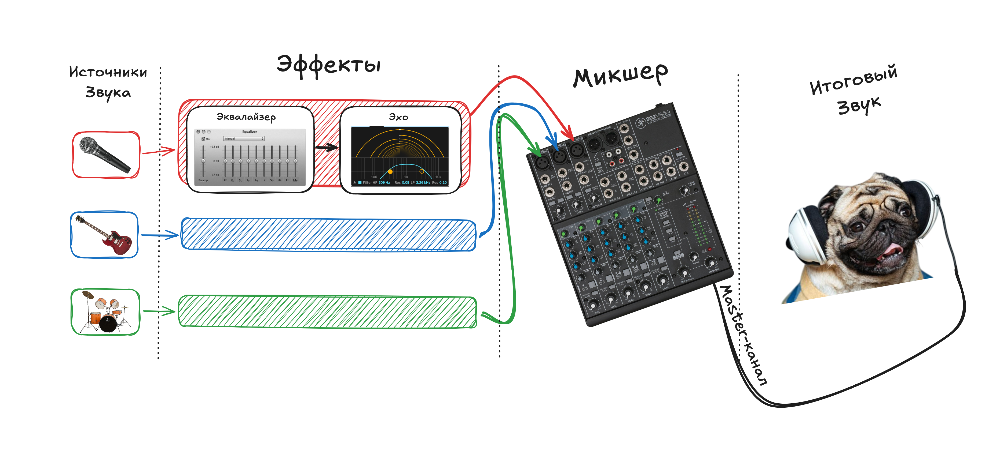
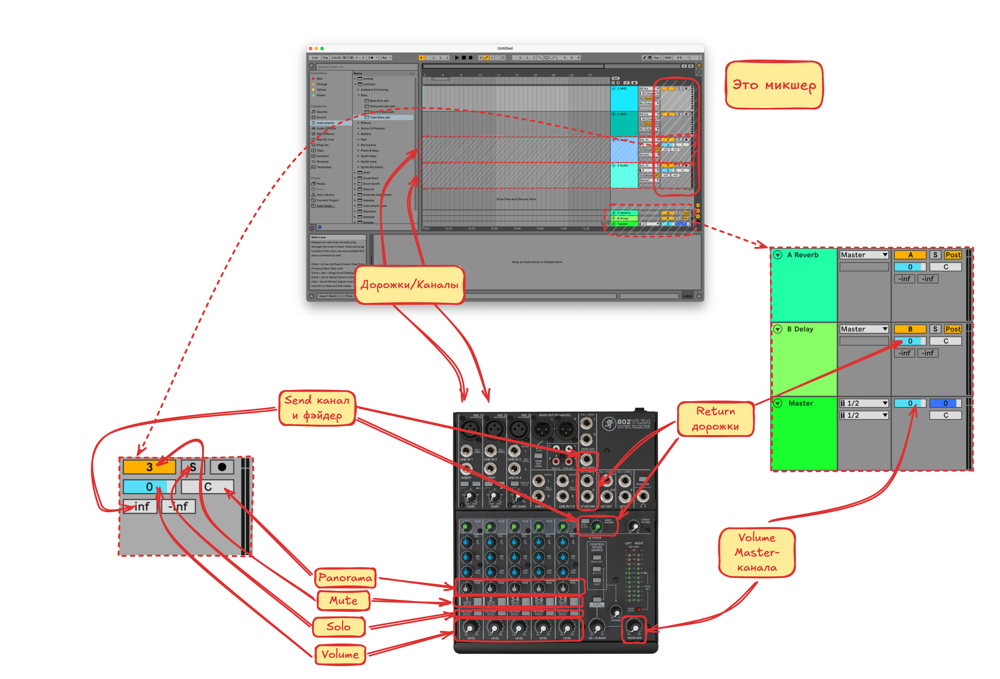

# Конспектик по Ableton Live 11

По курсу от [отечественного битмейкера](https://www.youtube.com/watch?v=cdcgVkYV0k4&t=3191s)

## Советы

Полезно изучить системные выпадающие меню

Особенно меню **View**

Нажимаем на пункт меню и смотрим что меняется в интерфейсе

## [DAW (Digital Audio Workstation)](https://www.youtube.com/watch?v=cdcgVkYV0k4&t=3191s)

Все **DAW** программы работают по одному принципу

**Источники** звука отправляют сигналы в **плагины**, которые как-то обрабатывают звук и отправляют в **микшер**, где , который объединяет все обработанные звуки в **итоговый**, при этом на микшере так-же можно сделать некоторую обработку, например увеличить/уменьшить громкость определённых частот (см. крутилки на микшере)

## [Интерфейс, плэйлист, браузер](https://youtu.be/cdcgVkYV0k4?si=cMZCAJBRxUy0doN7&t=664)

Посмотрим что мы видим перед собой при первом запуске **Ableton**, разберём зачем тут столько всего

## [MIDI (Musical Instrument Digital Interface) дорожки](https://youtu.be/cdcgVkYV0k4?si=ovXWhRoDmKv3r-Yf&t=1912)

**MIDI** это цифровой инструмент. Для того чтобы записать на дорожку звук, генерируемый таким инструментов необходимо

1. Создать **MIDI**-дорожку, если её ещё нет и назначить инструмент
2. После назначения инструмента можно поиграть на нём с помощью клавиатуры компьютера на клавишах `A-W-S-E-D-F-T-G-Y-H-U-J-K`. Эти клавиши имитируют одну октаву клавиш пианино. Для того, чтобы слышать звук выбранного инструмента, необходимо включить режим игры на клавиатуре либо **In** либо **Auto** со включённым режимом записи на дорожку. При включённом режиме игры на клавиатуре некоторые сочетания клавиш могут не работать, поэтому его нужно не забывать выключать
3. После этого необходимо **выделить участок на дорожке**, в этот участок будет записана последовательность звуков, которые будут воспроизводиться инструментом. По выделенному участку нажимаем правой кнопкой и выбираем **Insert Empty MIDI Clip(s)** 
4. Теперь на дорожке появилась область в которую можно записать звуки с помощью **Piano Roll**, это область внизу экрана. Чтобы добавить ноту на **Piano Roll** нажимаем 2 раза мышкой в нужном месте, и в этом месте появится нота. Так-же можно записывать звук в реальном времени, нажам кнопку запись в верхней части окна. Если звука нет, нужно убедиться что нажата кнопка со значком ноты в правой части дорожки, эта кнопка обозначает что запись производится на выбранную дорожку 

### [Из audio в MIDI](https://youtu.be/cdcgVkYV0k4?si=PKfoA7ujtLyquWEN&t=2352)

На пустую **MIDI**-дорожку можно перетащить любой звуковой файл, и попробовать конвертировать его в последовательность звуков, которые могут быть проиграны инструментом

## [Эффекты](https://youtu.be/cdcgVkYV0k4?si=B-Hy4Ipm9H8UPT8O&t=2989)

Перетаскиваем эффект в секцию эффектов дорожки

## [Микшер](https://youtu.be/cdcgVkYV0k4?si=AAApZ2UJl63TXLJ0&t=3182)

Принимает звук из разных дорожек и смешивает в одну дорожку. Для каждой дорожки имеет слеюдующие настройки

1. **Mute/Solo**. Заглушить дорожку / Заглушить все дорожки кроме выбранной
2. **Volume**, **Panorama**. Уменьшить громкость дорожки, направить звук в правый или левый канал
3. **Блок Send**. Направить сигнал на один из **Return**-дорожек
4. **Master**. Параметры итогового исходящего сигнала. А так-же почему тут регулируется **громкость прослушиваемых инструментов**

## [Send и Return дорожки](https://youtu.be/cdcgVkYV0k4?si=juT5TGC2g6J5qin2&t=4158)

Предоставляют возможность скопировать сигнал с выбранной дорожки на **Return** канал, с целью добавления каких-то эффектов и последующей отправки в **Master** канал

Распологаются над **Master**-дорожкой. За подачу сигнала на эти дорожки отвечают фэйдеры на дорожке в нижней части блока микшера. Удобнее управлять этими дорожками в режиме сессии

На эти дорожки **копируется** звук, приходящий в микшер, этот звук там тоже как-то обрабатывается и то, что получилось отправляется в **Master**-канал, и там это всё сливается в один звук

**Return**-дорожки могут быть в режиме **Pre-Fader** (звук отправляется в **Return** канал до применения настроек микшера, влияет только настройка громкости звука) и **Post-Fader** (звук отправляется в **Return** канал после применения настроек микшера). Чтобы понять как это влияет на звук проще потыкать это в программе

**Send/Return**-дорожки используются в основном при сведении звука

## [Группировка дорожек](https://youtu.be/cdcgVkYV0k4?si=0ThIkpUs4uCYW5wf&t=5359)

Дорожки можно объединять в группы. При группировке дорожек их исходящий сигнал идёт в микшер группового канала, после чего в итоговый микшер. К группе можно применять эффекты и настривать параметры микширования так же как у отдельной дорожке

- Создать группу
  1. Выделить несколько дорожек с зажатым `Shift` или `Cmd`
  2. Нажать правой кнопкой и выбрать **Group Tracks**
- Разгруппировать можно нажав правой кнопкой на группе и выбрав **Ungroup Tracks**
- Добавить дорожку в группу можно путём перетаскивания
- Убрать дорожку из группы так-же путём перетаскивания за пределы группы

## [Запись](https://youtu.be/cdcgVkYV0k4?si=XmU7o8RxYQChUEjI&t=6602)

За запись отвечает блок контроля входящего сигнала `(1)`. Показать/скрыть его можно из меню `View -> In/Out`

### Выбор записывающего устройства

Выпадающее меню `(2)` позволяет выбрать с какого канала устройства производить запись

### Вывод звука с записывающего устройства

Блок **Мониторинга** `(3)` отвечает за то будет ли пропускаться сигнал с выбранного канала дальше на микшер

- **In** - пропускать сигнал всегда
- **Auto** - пропускать сигнал только в режиме записи `(4)`
- **Off** - не пропускать сигнал

### Запись на дорожку

Для начала записи звука на дорожку нужно 

- Нажать кнопку записи на дорожке `(4)`. Нажатая кнопка показывает на какую дорожку будет производиться запись
- Нажать кнопку записи в блоке `(5)`

После чего звук начнёт записываться. Для завершения записи можно нажать кнопку **Record** или **Stop** в блоке `(5)`

На дорожку с записанным звуком можно применять эффекты

## [Коммутация каналов](https://youtu.be/cdcgVkYV0k4?si=rRl9AsLsv5wZPd8F&t=7674)

У дорожек есть параметры коммутации

- **Откуда брать** сигнал. По умолчание **Ext. In** (внешний источик (обычно это звуковая карта))
- **Куда выводить** сигнал. По умолчанию **Master**-дорожка микшера

### Варианты входящего сигнала

#### Ext. In

Это обычно внешняя звуковая карта

#### Configure

Позволяет быстро открыть меню выбора входящего звукового устройства

#### Resampling

Этот режим позволяет записать звук из **Master**-канала микшера, сигнал при этом не будет зацикливаться, так как при записи **Abelton** не пропустит этот сигнал на микшер по второму кругу. В программе это видно по тому, что полоски уровня звука на **Resampling**-дорожке будут серого цвета

##### Запись на Resampling-дорожку

1. Создать пустой **Audio Track**
2. Выбрать на нём **Resampling** в качестве входящего сигнала
3. Включить запись на дорожке
4. Записать звук
5. Теперь у нас есть дорожка, на которой записан итоговый звук из **Master**-канала микшера. Наверное это зачем-то нужно :)

#### Дорожка

При записи с другой дорожки звук копируется в одном из трёх возможных мест, до **эффектов**, после **эффектов и до микшера** и **после микшера** 

Все варианты под **Resampling** (кроме **Master**) это другие дорожки проекта, любую из них можно выбрать как источник и записать звук, выбрав в каком месте звук должен быть скопирован

 

#### Master

То-же самое что и **Resampling**, но без контроля зацикливания сигнала. Лучше не использовать

#### No Input

Ставим когда ничего не хотим записывать на дорожку

### Варианты исходящего сигнала

#### Ext. Out

Сигнал направляется напрямую на наушники/колонки, миную мастер канал. Настройки громкости мастер канала не будут влиять на выбранную дорожку

#### Configure

Быстрый доступ к настройкам аудиоустройства

#### Master

Выводить сигнал на **Master**-канал, учитывая его настройки громкости, установлено по умолчанию

#### Дорожка

Выводить сигнал с одной или нескольких дорожек можно на другую дорожку, это возволит записать звук с нескольких дорожек на другую дорожку. Это не то-же самое, что запись с мастер канала, так как можно записывать не со всех дорожек а только с выбранных

Для записи звука с других дорожек необходимо установить на них необходимую дорожку в качестве выхода и произвести запись

## TODO

Переделать скиншоты через **Excalidraw**

## Материалы

- [Картинки](https://excalidraw.com/#json=TmBUA64T4uukpk_kYsL4O,g1bMITlU4yb7yc_LYcRuYA)

