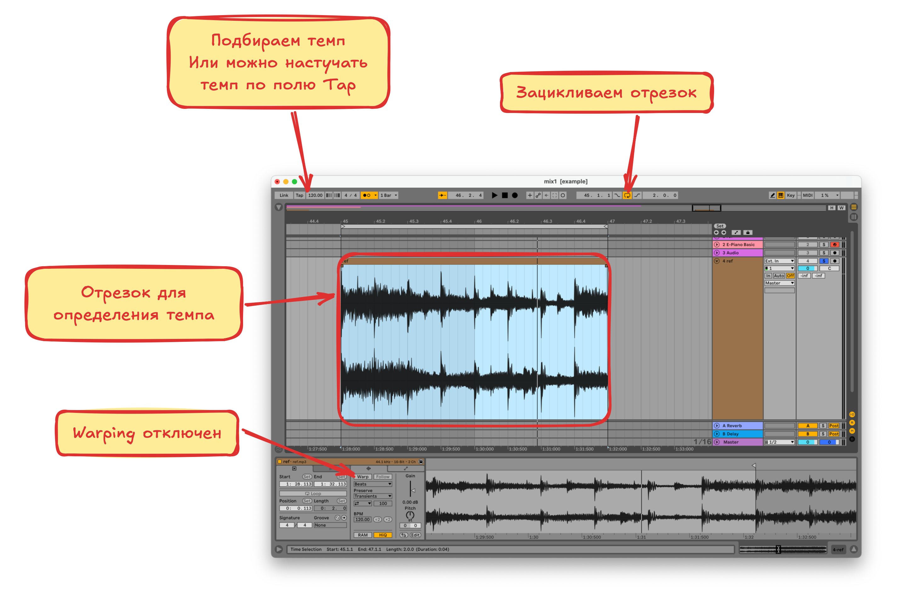

# Темп

**Темп** это скорость исполнения музыки, измеряемая в **ударах в минуту (BPM)**

## Определение темпа

1. Выделяем из трека отрезок длинной 1 или 2 такта
2. Отключаем варпинг на дорожке если он включён. Для этого нажимаем на шапку трека в окне аранжировки
3. Крутим **BPM** в **Ableton** пока выделеный отрезок не начнёт влезать **равно** в такт (если чуть-чуть влезать не будет можно руками продлить длину отрезка). Так-же можно включить метроном или настучать темп по полю **Tap**

