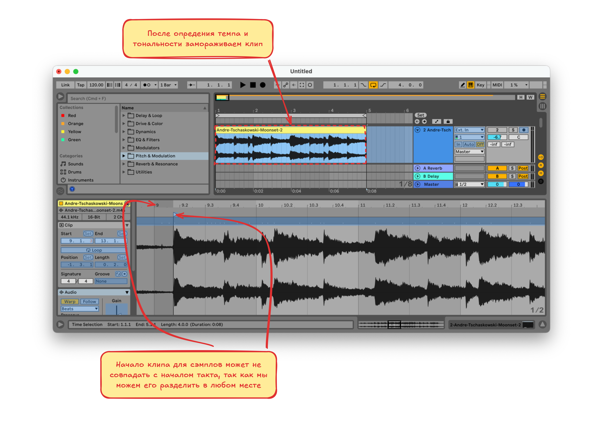
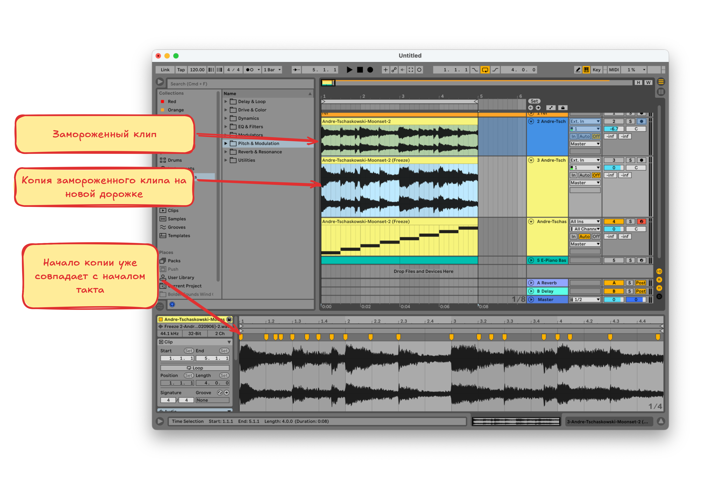

# Сэмлирование. Практика

Применим теорию на практике

## Референс

В качестве референса возьмём такую композицию

Определим тональность и темп на сайте https://vocalremover.org/ru/key-bpm-finder и проверим в Ableton как

**Тональность**: Ля-минор

**Темп**: 120

## Пишем мелодию

Для того, чтобы написать мелодию, нужно найти звуки для сэмплов, это можно сделать на ютубе или в других местах

Для нарезки сэмплов возьмём такую композицию

### Как правильно нарезать сэмплы

- В Ableton на отдельную дорожку добавляем композицию для сэмплов
- Определяем её темп и тональность, так-же как и для референса. Если тональность не подходит, используем **Pitch** в нижней части окна, или эффект **Shifter**
- После подгонки отрезка для сэмплирования по темпу и тональности важно его заморозить (`Freeze` в контекстном меню). Потому что подогнанный отрезок может не точно совпадать с началом такта, а копия замороженного отрезка будет восприниматься как новый клип и его начало совпадёт с началом такта, это позволит создать сэмплы, которые будут хорошо "влезать" в такты. К "замороженному" клипу так-же применяются все эффекты и CPU не тратится на их вычисление при проигрывании
- Создаём новую дорожку и копируем на неё замороженный клип, начало такта копии уже будет совпадать с началом такта 
- Теперь выравниваем транзиенты по тактам и делаем MIDI-ноты из клипа. Для этого в контекстном меню клипа выбираем `Slice to New MIDI Track`
