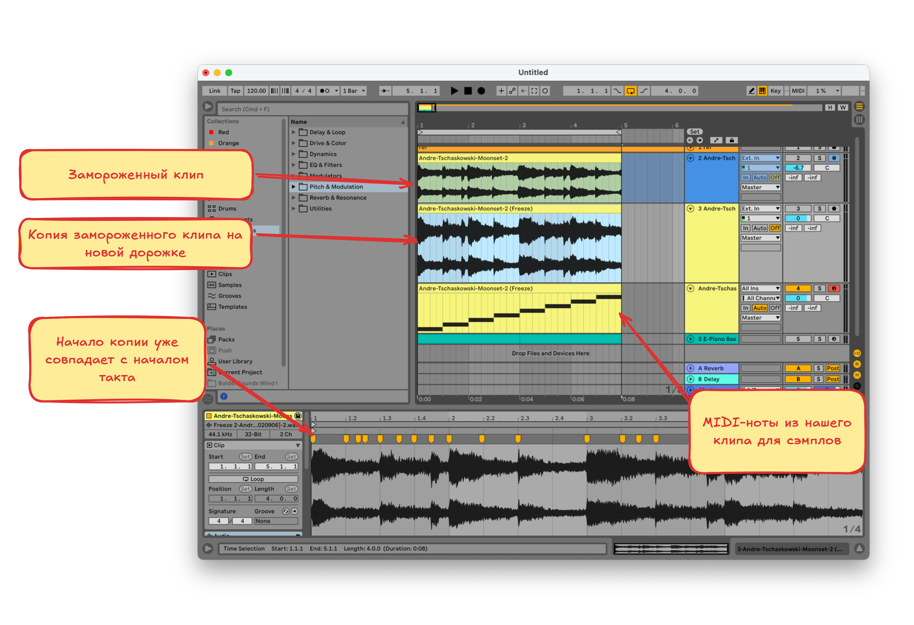

# Сэмлирование. Практика

Применим теорию на практике

## Референс

В качестве референса возьмём такую композицию

Определим тональность и темп на сайте https://vocalremover.org/ru/key-bpm-finder и проверим в Ableton

**Тональность**: Ля-минор

**Темп**: 120

## Пишем мелодию

Для того, чтобы написать мелодию, нужно найти звуки для сэмплов, это можно сделать на ютубе или в других местах

Для нарезки сэмплов возьмём такую композицию

### Как правильно нарезать сэмплы

- В Ableton на отдельную дорожку добавляем композицию для сэмплов
- Определяем её темп и тональность, так-же как и для референса. Если тональность не подходит, используем **Pitch** в нижней части окна, или эффект **Shifter**
- После подгонки отрезка для сэмплирования по темпу и тональности важно его заморозить (`Freeze` в контекстном меню). Потому что подогнанный отрезок может не точно совпадать с началом такта, а копия замороженного отрезка будет восприниматься как новый клип и его начало совпадёт с началом такта, это позволит создать сэмплы, которые будут хорошо "влезать" в такты. К "замороженному" клипу так-же применяются все эффекты и CPU не тратится на их вычисление при проигрывании

Теперь у нас есть несколько вариантов превращения исходного клипа в сэмплы

#### Simpler. MIDI-инсрумент

Создаём MIDI-дорожку, назначаем на неё инструмента **Simpler**, затем перетаскиваем в него наш замороженный трек

Далее настраиваем способ разделения на сэмплы

- Slice By: **Beat**. Дорожка будет разделена по тактам
- Division: **1/4**. Частота деления
- Playback: **Thru**. При проигрывании сэмпл будет доигрывать до конца клипа или пока не будет воспроизведён следующий сэмпл
- Fade In: **250 ms**. При разделении клипа на участки, новый участок начинат играть сразу с ненулевой громкостью, из-за чего можно слышать щелчки. Данная ручка настраивает время увеличения уровня громкости от нуля

Теперь у нас есть MIDI инструмент и можно попробовать что-нибудь им поиграть

#### Slice to MIDI Track

Создаём новую дорожку и копируем на неё замороженный клип, начало копии уже будет совпадать с началом такта. Выравниваем транзиенты по тактам и делаем MIDI-ноты из клипа. Для этого в контекстном меню клипа выбираем `Slice to New MIDI Track`

#### Ручное разделение дорожки

Разделим дорожку руками на части. Для этого:

1. Выставим подходящий масштаб с помощью `Cmd + 1/2` 
2. Разделим дорожку по масштабу с помощью `Cmd + E`, `Стрелка Вправо`
3. Удалим нечётные кусочки
4. Растянем оставшиеся кусочки с зажатым `Shift`
5. Выставим алгоритм варпинга в `Complex Pro`. Для этого выделим все кусочки, перейдём в свойства дорожки, там есть соответсвующее меню

