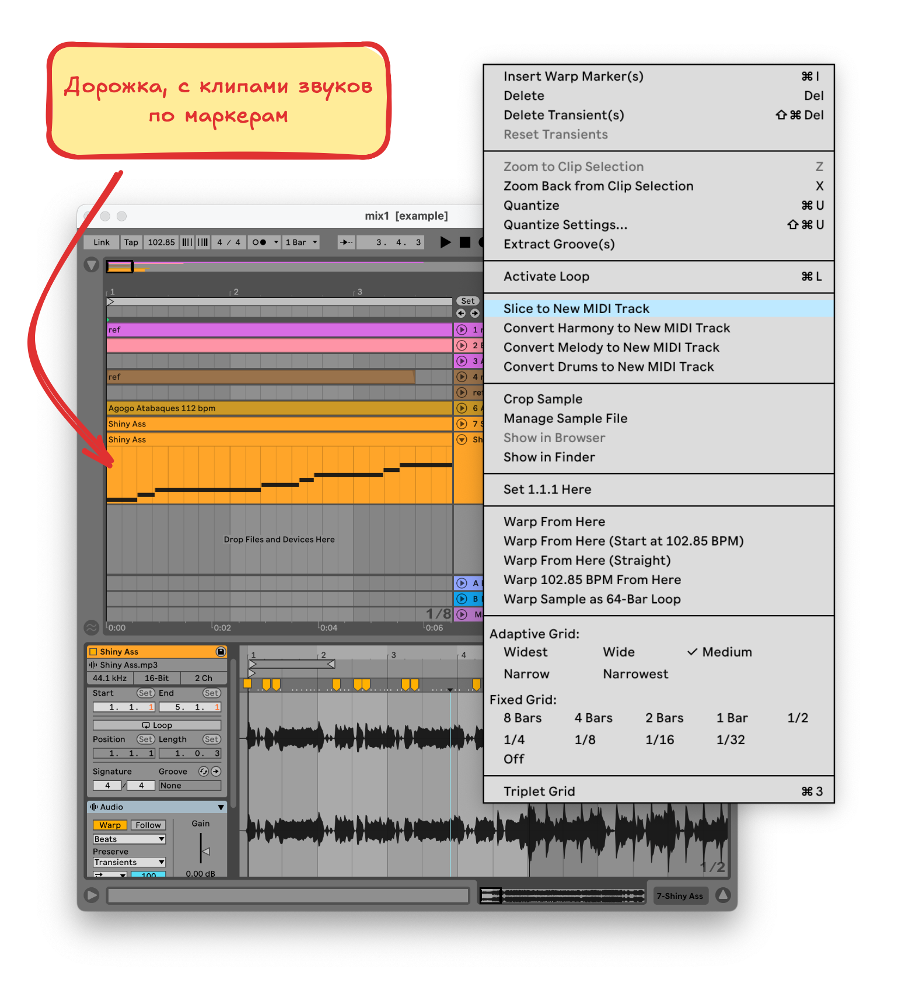

# Превращаем клип в MIDI-инструмент

После [warping-a](./warping.md) у нас есть расставленные маркеры, по этим маркерам мы можем разделить клип на отрезки, которые будут соотнесены с MIDI-нотами. Эти MIDI-ноты мы будем использовать в своей композиции

