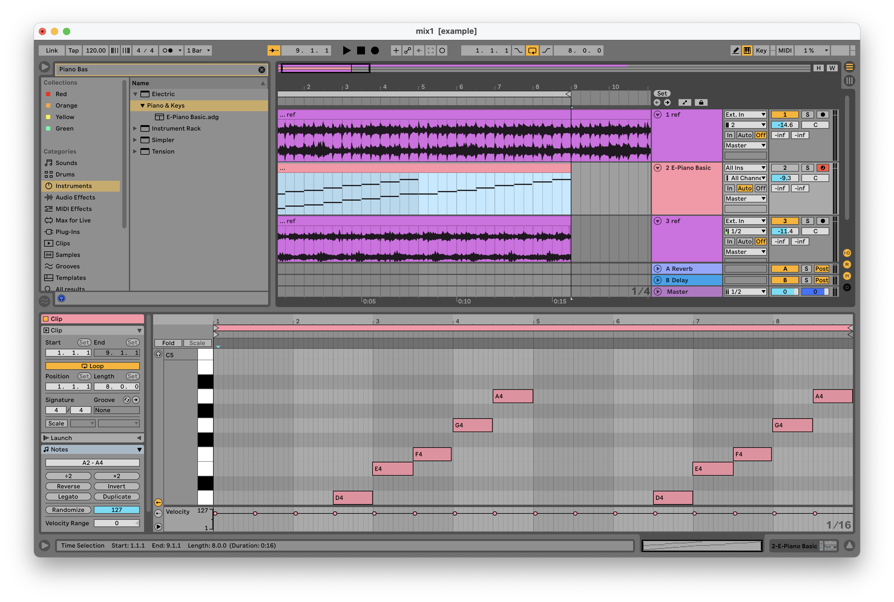

# Определение тональности

**Тональность в музыке** это система организации звуков вокруг **главного тона (тоники)**, которая определяет лад (мажор/минор) и набор используемых нот (гамму)

1. Переносим референс на аранжировку и выбираем отрезок, на котором будем определять тональность (выделяем часть референса, разделяем его и зацикливаем выбраный участок)
2. Создаём рядом **MIDI**-дорожку со стандартным пианином (**E-Piano Basic**) и добавляем эффект **Pitch**
3. Воспроизводим референс и одновременно играем гамму или просто ноты в определённом ладу и тональности, как только тональность подошла значит это она и есть. Для удобства можно перемещаться между тональностями с помощью эффекта **Pitch**. Так-же гамму можно не играть а добавить на **Piano Roll**, как удобнее

