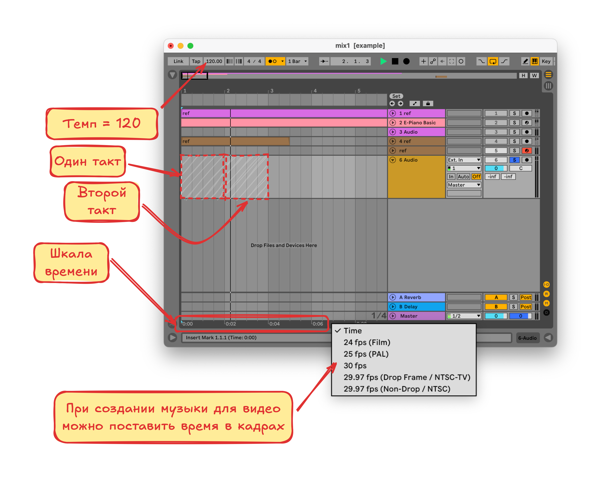
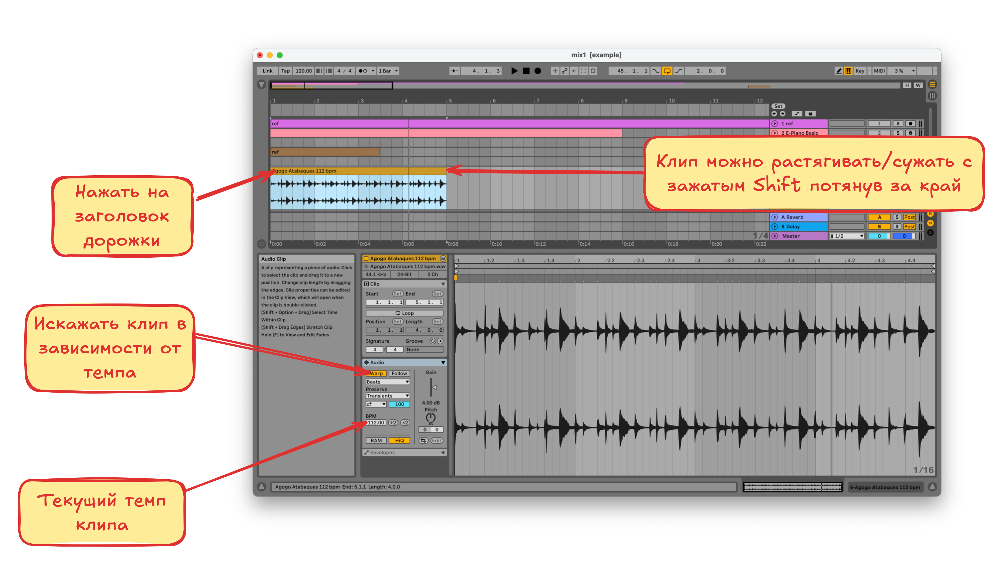
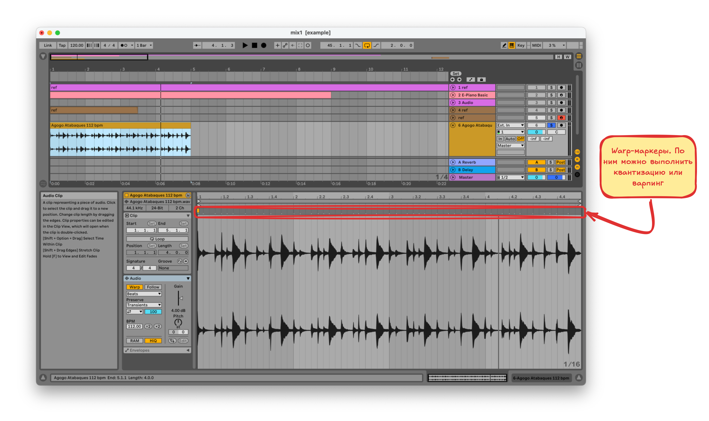
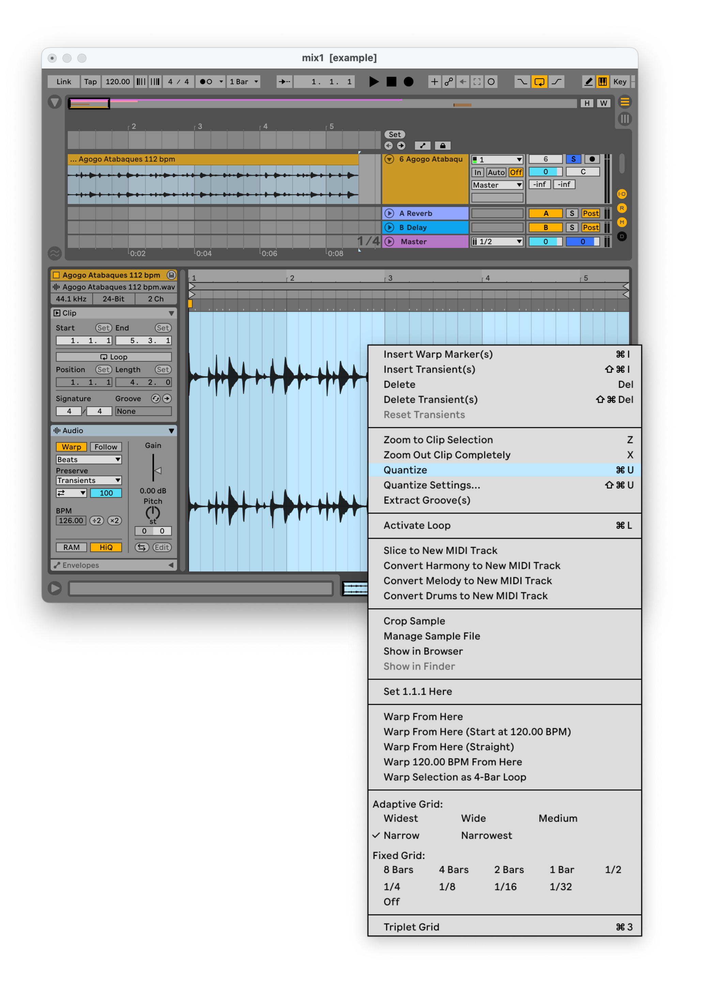
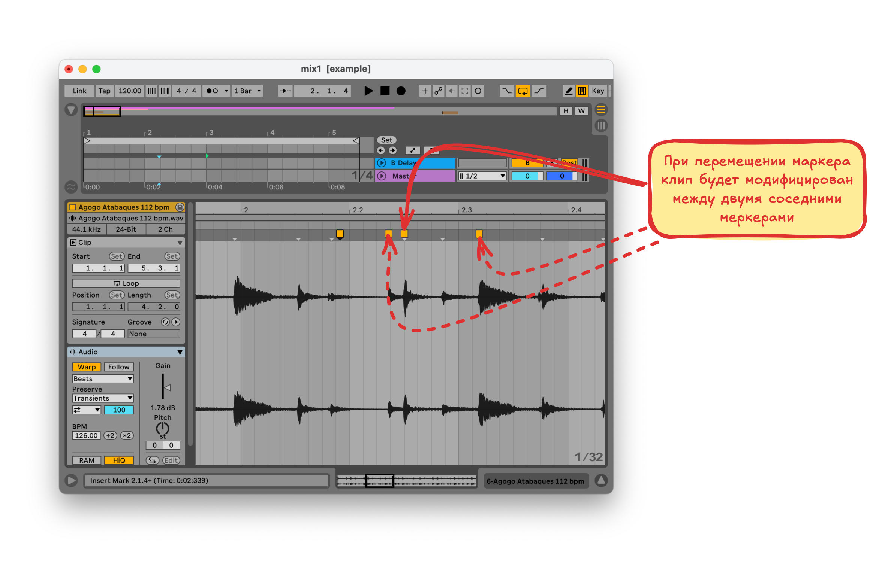

# Манипуляции со скоростью. Warping

Чтобы понять как работают манипуляции со скоростью нужно обратить внимание на шкалу времени

## Шкала времени и темп

При изменении **темпа** изменится **масштаб временной шкалы** в нижней части экрана

**Такты** окрашены в разные цвета, первый потемнее, второй посветлее и так далее

## Изменение темпа клипа

При перетаскивании семпла на пустой проект, темп проекта установится в темп семпла, если у семпла есть эти метаданные

При активации **Warping**-а трек можно будет растягивать и сужать по времени с помощью явной установки значения **BPM** или растягивая клип на дорожке с зажатым `Shift`

## Искажение темпа внутри клипа

Так-же при активации **warping**-а в окошке клипа появляются **транзиенты** в виде серых точек

### Квантизация

**Транзиенты** используются при автоматической квантизации (выравнивания по долям (полоски внутри такта это доли)). Для этого нужно выделить весь клип и в контекстном меню выбрать `Quantize`

### Редактирование Warp-маркеров и транзиентов

- Для **удаления** транзиентов нужно выделить участок клипа и нажать `Del` 
- Для **добавления** **warp**-маркера  нужно два раза нажать в нужном месте в окне клипа. Можно так-же создать **warp**-маркеры на выделенном участке, через контекстное меню
- **Warp**-маркер можно перемещать. При этом клип будет растянут/сжат **относительно** соседних маркеров

